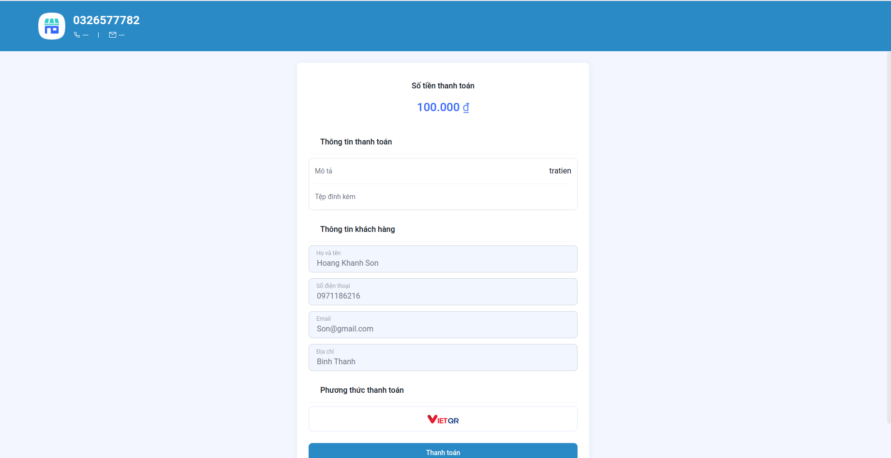
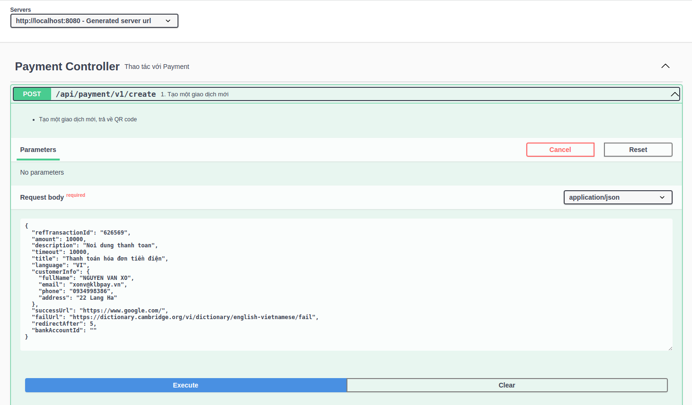
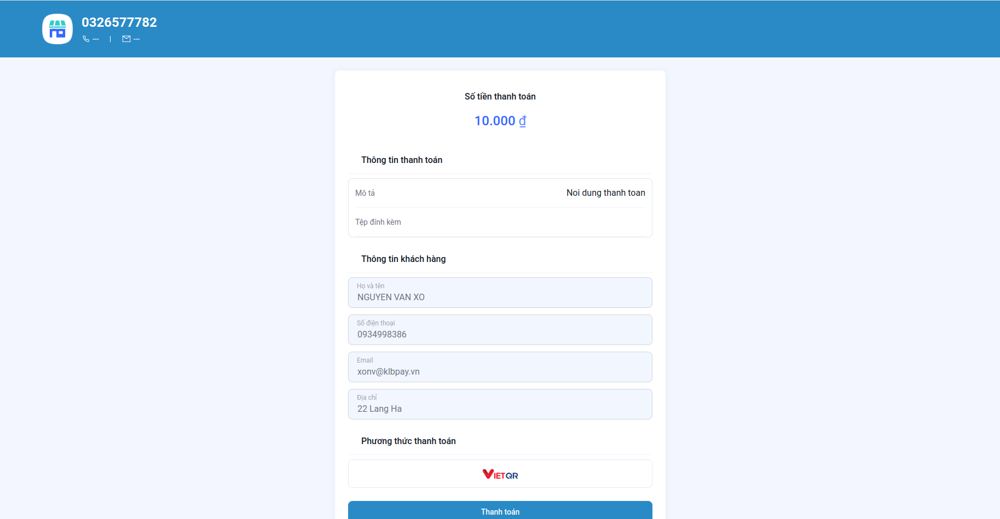

# KLBPay-Java-SDK
## **Ví dụ cơ bản**

### **Tạo giao dịch**:
```java
CreateTransactionResponse response = kPayClient.createTransaction(request);
```


Tạo Controller như sau
```java
import io.swagger.v3.oas.annotations.Operation;
import io.swagger.v3.oas.annotations.tags.Tag;
import org.springframework.http.ResponseEntity;
import org.springframework.web.bind.annotation.PostMapping;
import org.springframework.web.bind.annotation.RequestBody;
import org.springframework.web.bind.annotation.RequestMapping;
import vn.unicloud.sdk.payment.client.ResponseBase;
import vn.unicloud.sdk.payment.transaction.request.CreateTransactionRequest;

import javax.validation.Valid;

@Tag(name = "Payment Controller", description = "Thao tác với Payment")
@RequestMapping(value = "/api/payment")
public interface IPaymentController {

    /**
     * @param request
     * @return
     */
    @Operation(
            summary = "1. Tạo một giao dịch mới",
            description = "- Tạo một giao dịch mới, trả về QR code"
    )
    @PostMapping("/v1/create")
    String createTransaction(
            @Valid @RequestBody CreateTransactionRequest request

    );
}
```
```java

import lombok.RequiredArgsConstructor;
import lombok.extern.slf4j.Slf4j;
import org.springframework.http.ResponseEntity;
import org.springframework.web.bind.annotation.RestController;
import org.springframework.web.client.RestTemplate;
import vn.unicloud.sdk.payment.KPayClient;
import vn.unicloud.sdk.payment.client.ResponseBase;
import vn.unicloud.sdk.payment.client.ThirdPartyClient;
import vn.unicloud.sdk.payment.config.PaymentConfigurationProperties;
import vn.unicloud.sdk.payment.transaction.request.CreateTransactionRequest;
import vn.unicloud.sdk.payment.transaction.response.CreateTransactionResponse;


@RestController
@Slf4j
@RequiredArgsConstructor
public class PaymentController implements IPaymentController {

    RestTemplate restTemplate = new RestTemplate();
    ThirdPartyClient client = new ThirdPartyClient(restTemplate);
    PaymentConfigurationProperties properties = new PaymentConfigurationProperties();
    KPayClient kPayClient = new KPayClient(properties, client);

    @Override
    public String createTransaction(CreateTransactionRequest request) {

        CreateTransactionResponse response = kPayClient.createTransaction(request);

        return response.getUrl();
    }
}
```
Chạy thử dự án
http://localhost:8080/swagger-ui/index.html

Giap diện API UI



Bấm vào phần Tạo giao dịch


Nhập json dưới đây để test giao dịch

```json
{
  "refTransactionId": "626569",
  "amount": 10000,
  "description": "Noi dung thanh toan",
  "timeout": 10000,
  "title": "Thanh toán hóa đơn tiền điện",
  "language": "VI",
  "customerInfo": {
    "fullName": "NGUYEN VAN XO",
    "email": "xonv@klbpay.vn",
    "phone": "0934998386",
    "address": "22 Lang Ha"
  },
  "successUrl": "https://www.google.com/",
  "failUrl": "https://dictionary.cambridge.org/vi/dictionary/english-vietnamese/fail",
  "redirectAfter": 5,
  "bankAccountId": ""
}
```

Bấm Excute 
Response sẽ trả về URL Thanh toán

Copy URL vào trình duyệt Bấm vào để mở thanh toán 

### **Kiểm tra giao dịch** (tương tự):
```java
QueryTransactionResponse response = kPayClient.queryTransaction(request);
```

### **Hủy giao dịch** (tương tự):

```java
CancelTransactionResponse response = kPayClient.cancelTransaction(request);


```